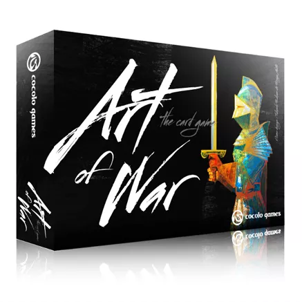
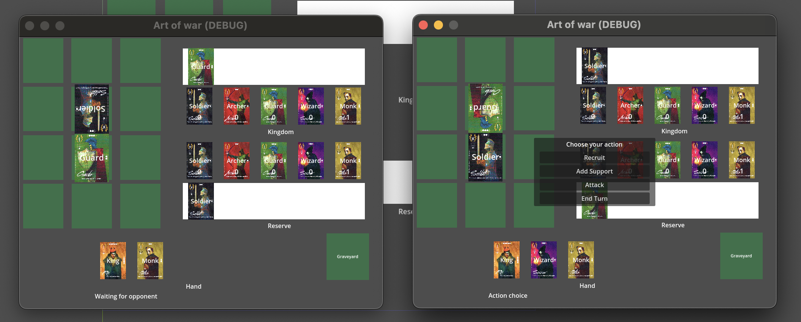

# Art Of War

## Introduction

Arf Of War is a card game for two players, originally published by [IgiAri](https://www.igiari.com/) but has been discontinued.

## Rules

You can find some information about the game on [BoardGameGeek](https://boardgamegeek.com/boardgame/173452/art-war-card-game).

## Development

This game is made with Godot Engine version 4.x. The current version is an early prototype meant to implement the game mechanics and is using local multiplayer.

Once the game mechanisms will be fully implemented, I'll work on the design part and implement some better visuals to make the game more enjoyable.

## Multiplayer

The game is multiplayer, it means it requires a server to run. Thankfully, it's possible to work locally. The default configuration in Network.gd
uses localhost and starts the game in dev mode. To test it, you need to launch 3 instances, one that will start the server,
the two other that will connect to the server and be able to create a game or join one.

In "prod" mode, you need to indicate the IP of the remote server instead of localhost. The client will automatically try to connect to it.

TODO : Manage connection failure and server disconnection.

## License

This work is licensed under a MIT License.
