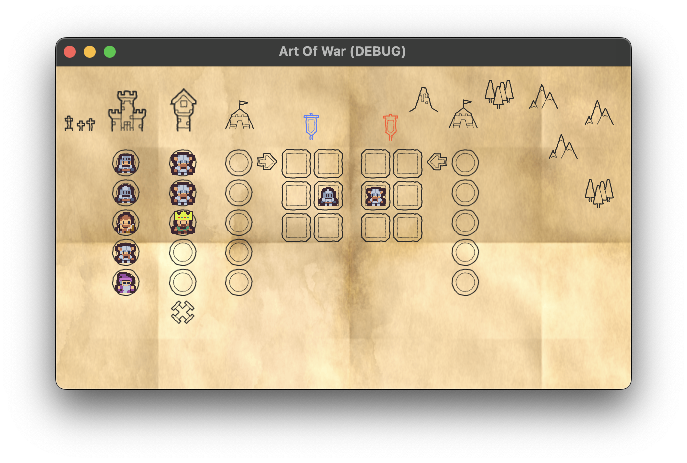

# Art Of War

## Introduction

Arf Of War is a card game for two players, originally published by [IgiAri](https://www.igiari.com/) but has been discontinued. 

## Rules

You can find some information about the game on [BoardGameGeek](https://boardgamegeek.com/boardgame/173452/art-war-card-game).

## Development

This game is made with Godot Engine version 4.x. The current version is an early prototype meant to implement the game mechanics and is using local multiplayer.

Once the game mechanisms will be fully implemented, I'll work on the design part and implement some better visuals to make the game more enjoyable.

## License

This work is licensed under a MIT License.
